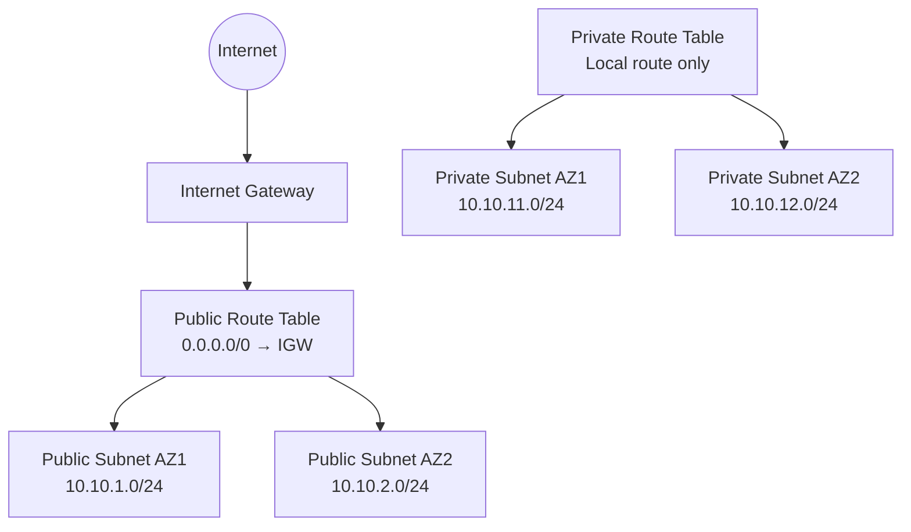

# Lab 01: Multi-AZ VPC Foundation

## Objective

Build a dedicated AWS networking lab in `us-east-1` without modifying the account's default VPC.

The design uses two Availability Zones, separate public and private subnets, an internet gateway, and dedicated route tables. No compute instances or NAT gateways are created.

## Architecture



## Address Plan

| Resource | CIDR | Public IPv4 on launch | Route behavior |
|---|---:|---:|---|
| VPC | `10.10.0.0/16` | N/A | Local VPC routing |
| Public subnet AZ1 | `10.10.1.0/24` | Enabled | Default route to internet gateway |
| Public subnet AZ2 | `10.10.2.0/24` | Enabled | Default route to internet gateway |
| Private subnet AZ1 | `10.10.11.0/24` | Disabled | Local route only |
| Private subnet AZ2 | `10.10.12.0/24` | Disabled | Local route only |

## Design Notes

- The existing default VPC is left unchanged.
- Public and private subnets span two Availability Zones.
- Public subnets use a dedicated route table with `0.0.0.0/0` routed to the internet gateway.
- Private subnets use a separate route table with no internet default route.
- No NAT gateway is deployed in this phase.
- A public subnet does not make a workload publicly reachable by itself. A workload also needs a public IPv4 address and appropriate security controls.

## Repository Files

- `deploy.sh` creates the VPC foundation.
- `validate.sh` checks the expected CIDRs, subnet settings, route-table associations, and internet-gateway attachment.
- `cleanup.sh` removes the lab after explicit confirmation.
- `.gitignore` prevents local state and output files from being committed.

## Prerequisites

- AWS CLI authenticated to the target account
- Permission to manage VPC networking resources
- Bash 4 or newer
- Region: `us-east-1`

## Usage

```bash
cd labs/01-vpc-foundation

chmod +x deploy.sh validate.sh cleanup.sh

./deploy.sh
./validate.sh
```

Destroy the lab only when intentionally finished:

```bash
./cleanup.sh --destroy
```

## Verified Build Result

The initial deployment produced:

- One custom VPC using `10.10.0.0/16`
- Two public `/24` subnets across two Availability Zones
- Two private `/24` subnets across two Availability Zones
- Automatic public IPv4 assignment enabled only on public subnets
- One attached internet gateway
- Separate public and private route tables
- No NAT gateway or compute resources

Resource IDs, account IDs, email addresses, and other account-specific values are intentionally excluded from this public documentation.
